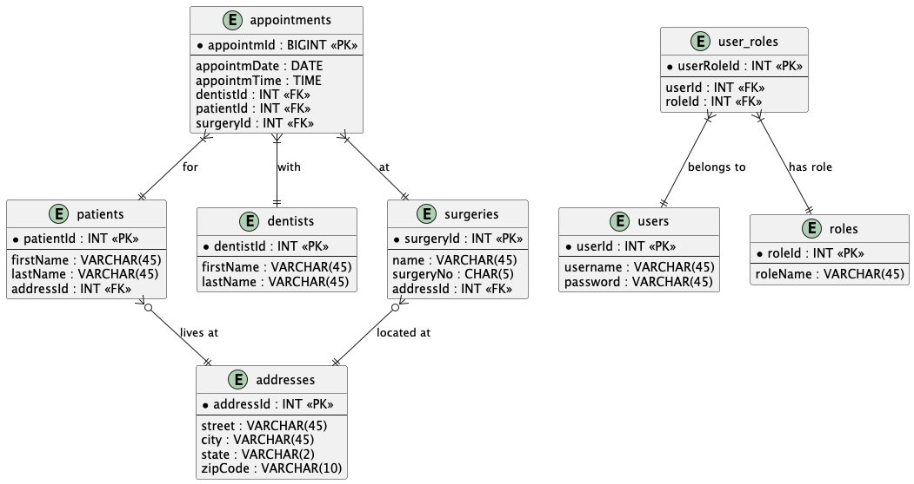

**1\. ER Diagram Design**
---------------------------

### Entities & Attributes

### **1\. `patients`**

-   
-`patientId` (PK)

-   `firstName`

-   `lastName`

-   `addressId` (FK → `addresses`)

Each patient has a **foreign key to an address**, enabling address reuse and normalization.


### **2\. `dentists`**

-   `dentistId` (PK)

-   `firstName`

-   `lastName`

Simple table for storing dentist info. Additional fields like email, phone, and specialization can be added if needed.


### **3\. `appointments`**

-   `appointmId` (PK)

-   `appointmDate` (DATE)

-   `appointmTime` (TIME)

-   `dentistId` (FK → `dentists`)

-   `patientId` (FK → `patients`)

-   `surgeryId` (FK → `surgeries`)

Each appointment is:

-   With 1 dentist

-   For 1 patient

-   At 1 surgery

### **4\. `surgeries`**

-   `surgeryId` (PK)

-   `name`

-   `surgeryNo` (likely a code like S10, S13)

-   `addressId` (FK → `addresses`)

Surgery location is linked to the shared `addresses` table.

### **5\. `addresses`**

-   `addressId` (PK)

-   `street`

-   `city`

-   `state`

-   `zipCode`

Used as a shared dimension for both **patients** and **surgeries**, which is good normalization practice.


### **6\. Authentication Tables (Users & Roles)**

#### `users`

-   `userId` (PK)

-   `username`

-   `password`

#### `roles`

-   `roleId` (PK)

-   `roleName`

#### `user_roles` (Join Table)

-   `userRoleId` (PK)

-   `userId` (FK → `users`)

-   `roleId` (FK → `roles`)

#### UML Diagram


**2\. SQL Implementation**
----------------------------------------------------------------

### Table Creation Example

```sql

CREATE DATABASE ADSDentalSurgery;
USE ADSDentalSurgery;

CREATE TABLE Dentist (
    dentist_id VARCHAR(10) PRIMARY KEY,
    first_name VARCHAR(50),
    last_name VARCHAR(50),
    phone VARCHAR(20),
    email VARCHAR(100),
    specialization VARCHAR(100)
);

CREATE TABLE Patient (
    patient_id VARCHAR(10) PRIMARY KEY,
    first_name VARCHAR(50),
    last_name VARCHAR(50),
    phone VARCHAR(20),
    email VARCHAR(100),
    address TEXT,
    dob DATE,
    has_unpaid_bill BOOLEAN
);

CREATE TABLE Surgery (
    surgery_id VARCHAR(10) PRIMARY KEY,
    name VARCHAR(100),
    address TEXT,
    phone VARCHAR(20)
);

CREATE TABLE Appointment (
    appointment_id INT AUTO_INCREMENT PRIMARY KEY,
    appointment_date DATE,
    appointment_time TIME,
    confirmation_sent BOOLEAN,
    status VARCHAR(20),
    dentist_id VARCHAR(10),
    patient_id VARCHAR(10),
    surgery_id VARCHAR(10),
    FOREIGN KEY (dentist_id) REFERENCES Dentist(dentist_id),
    FOREIGN KEY (patient_id) REFERENCES Patient(patient_id),
    FOREIGN KEY (surgery_id) REFERENCES Surgery(surgery_id)
);
```


**3\. Dummy Data**
--------------------

Based on your image, here's a quick SQL insert for sample data:

```sql

INSERT INTO Dentist VALUES ('D01', 'Tony', 'Smith', '555-111', 'tony@ads.com', 'General');
INSERT INTO Dentist VALUES ('D02', 'Helen', 'Pearson', '555-222', 'helen@ads.com', 'Orthodontist');
INSERT INTO Dentist VALUES ('D03', 'Robin', 'Plevin', '555-333', 'robin@ads.com', 'Endodontist');

INSERT INTO Patient VALUES ('P100', 'Gillian', 'White', '555-000', 'gillian@x.com', '123 Street', '1990-01-01', false);
INSERT INTO Patient VALUES ('P105', 'Jill', 'Bell', '555-001', 'jill@x.com', '456 Road', '1985-05-10', false);
INSERT INTO Patient VALUES ('P108', 'Ian', 'MacKay', '555-002', 'ian@x.com', '789 Ave', '1992-02-02', false);
INSERT INTO Patient VALUES ('P110', 'John', 'Walker', '555-003', 'john@x.com', '321 Blvd', '1988-07-15', false);

INSERT INTO Surgery VALUES ('S10', 'Central Surgery', '10 Center Rd', '555-010');
INSERT INTO Surgery VALUES ('S13', 'North Surgery', '13 North St', '555-013');
INSERT INTO Surgery VALUES ('S15', 'South Surgery', '15 South Ave', '555-015');

INSERT INTO Appointment (appointment_date, appointment_time, confirmation_sent, status, dentist_id, patient_id, surgery_id)
VALUES
('2013-09-12', '10:00:00', true, 'Scheduled', 'D01', 'P100', 'S15'),
('2013-09-12', '12:00:00', true, 'Scheduled', 'D01', 'P105', 'S15'),
('2013-09-12', '10:00:00', true, 'Scheduled', 'D02', 'P108', 'S10'),
('2013-09-14', '14:00:00', true, 'Scheduled', 'D02', 'P108', 'S10'),
('2013-09-14', '16:30:00', true, 'Scheduled', 'D03', 'P105', 'S15'),
('2013-09-15', '18:00:00', true, 'Scheduled', 'D03', 'P110', 'S13');`
```

**4\. SQL Queries**
---------------------

### a) List of all dentists, sorted by last name

```sql

SELECT 
    * 
FROM 
    Dentist
ORDER BY 
    last_name ASC
;

```


### b) List of appointments for a given dentist (e.g. `'D01'`)

```sql

SELECT 
    A.*, 
    P.first_name, 
    P.last_name
FROM 
    Appointment A
JOIN 
    Patient P ON A.patient_id = P.patient_id
WHERE 
    A.dentist_id = 'D01';

```


### c) All appointments at a surgery location (e.g. `'S15'`)

```sql

SELECT 
    * 
FROM 
    Appointment
WHERE 
    surgery_id = 'S15';
```


### d) Appointments for a patient on a specific date

```sql

SELECT 
    * 
FROM 
    Appointment
WHERE 
    patient_id = 'P108' AND 
    appointment_date = '2013-09-12'
;
```

